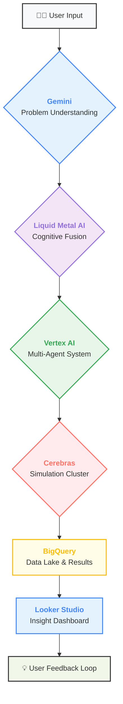
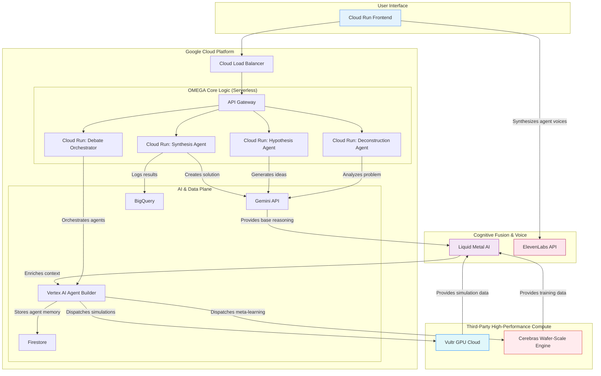
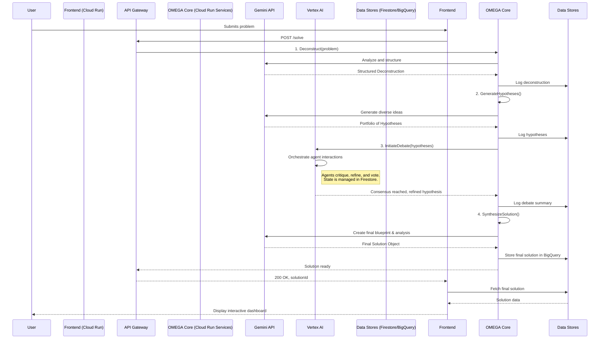
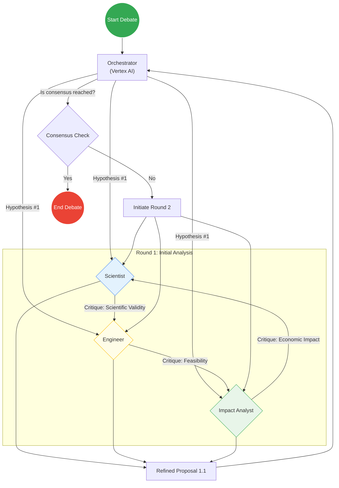

# 🌍 OMEGA — The Universal Problem-Solving Engine 🌌
> “An civilization that generates hypotheses, debates, and builds solutions — for *any* problem in the universe. 💫”

---

## 🚀 Overview

**OMEGA** is an *autonomous reasoning civilization* — a living AI ecosystem designed to understand, simulate, and solve the world’s most complex problems.

It uses **multi-agent reasoning**, **hypothesis generation**, and **cognitive simulation** powered by a federated network of advanced cloud and AI infrastructure. This includes **Google Cloud Run** for serverless orchestration, **Vertex AI** for agent management, **Gemini** for core reasoning, and a suite of specialized third-party services like **Liquid Metal AI** for cognitive fusion, **Cerebras Wafer-Scale Engines** for accelerated training, and **Vultr GPU Cloud** for elastic simulation workloads.

OMEGA is designed to:
- 🎯 **Deconstruct** problems from any discipline (science, policy, economy, ethics).
- 💡 **Hypothesize** and evaluate multitudes of potential solutions.
- 💬 **Debate** the merits of each hypothesis among a team of specialized AI agents.
- 🔬 **Simulate** the real-world impact of solutions using high-performance computing.
- ✅ **Synthesize** and deliver validated blueprints optimized for impact, cost, and sustainability.

---

<h2>🧠 The OMEGA Protocol: A Six-Stage Cognitive Symphony 🎶</h2>

The engine operates on a structured, six-stage protocol that transforms a high-level problem into a concrete, actionable solution.

<h3>1. 📥 Problem Understanding Engine</h3>

Users submit any challenge in natural language — from “stabilize coral reefs” to “build carbon-negative cities.” The **Gemini Understanding Engine**, running on a dedicated Cloud Run service, parses this input into a structured, machine-readable format. It identifies:
- **🔑 Core Variables & Dependencies**: What are the key factors and how do they relate?
- **🚧 Constraints & Boundaries**: What are the physical, economic, or ethical limitations?
- **🏆 Desired Outcomes**: What does a successful solution look like in measurable terms?
- **📚 Knowledge Domains**: Which fields of science, engineering, or policy are relevant?

This initial analysis forms the foundation of OMEGA’s **Reasoning Graph** — a dynamic cognitive map of the problem space that evolves throughout the entire process.

<h3>2. 🌐 Distributed Intelligence Core</h3>

OMEGA's power comes from its federated, hybrid-cloud architecture that leverages the best of serverless, AI platforms, and specialized hardware.

| Subsystem | Description |
|------------|--------------|
| 🧩 **Cloud Run Microservices** | Each AI agent and protocol stage runs as an independent, auto-scaling service. |
| ⚙️ **Vertex AI Pipelines** | Manages the training, fine-tuning, and operational deployment of all reasoning models. |
| 🧬 **Liquid Metal AI Layer** | A hybrid neural-cognitive fusion engine that enables *dynamic reasoning* across heterogeneous models (LLMs, symbolic AI, graph reasoning, and physics engines). |
| 💠 **Cerebras Wafer-Scale Cluster** | Accelerates the training of ultra-large hypothesis graphs and runs meta-simulations in real time. |
| ☁️ **Vultr GPU/TPU Mesh** | Provides elastic, cost-effective compute for rapid simulations, data synthesis, and parallel multi-agent experiments. |
| 🔗 **BigQuery + Firestore** | Stores petabytes of experimental data, simulation results, and solution lineage for perfect reproducibility. |

<h3>3. 💡 Hypothesis Generation Engine</h3>

Using a blend of **Gemini's** creative reasoning and **Liquid Metal’s** meta-cognitive synthesis, OMEGA generates a diverse portfolio of structured hypotheses. These are not just simple ideas; they are comprehensive proposals spanning multiple domains:

- **🧪 Scientific**: Novel physical laws, biological mechanisms, or chemical pathways.
- **🛠️ Engineering**: Detailed design blueprints, manufacturing processes, and logistical models.
- **🤝 Societal**: Policy frameworks, ethical guidelines, and behavioral change strategies.

Each hypothesis is automatically tagged with a confidence index, required simulation parameters, ethical safety metrics, and a projected world impact score.

<h3>4. 🤖 Multi-Agent Reasoning Grid</h3>

This is the heart of OMEGA. A team of specialized AI Agents, orchestrated by **Vertex AI**, collaboratively debates the generated hypotheses. Each agent represents a distinct discipline, ensuring a holistic, 360-degree evaluation of every potential solution. The agents interact over Vertex AI’s multi-agent communication layer, forming a self-correcting dialectic system that is more powerful than any single model.

<h3>5. 🖥️ Cognitive Simulation Layer</h3>

OMEGA doesn't just theorize; it tests. It deploys **Cerebras-powered reasoning graphs** to run millions of parallel simulations in real-time, predicting the multi-faceted effects of proposed solutions across:
- 🌍 Environmental variables and climate models.
- ⛓️ Global supply chain and economic systems.
- 🧬 Complex biological and molecular responses.
- 👨‍👩‍👧‍👦 Human behavioral and societal dynamics.

This process enables *hypothesis evolution*. Weak ideas are falsified and discarded, while strong ideas are refined and adapted based on simulated real-world feedback.

<h3>6. 📊 Global Insight Dashboard</h3>

The final output is delivered through a real-time, interactive control hub built on **Looker Studio** and a **Cloud Run Frontend**. This dashboard provides a complete, transparent view of the entire problem-solving journey, showing:
- 🔴 Live feeds of AI debates and decision-making processes.
- 🧬 Hypothesis lineage and evolutionary paths.
- 🕸️ Visualized “Reasoning Webs” that link global problems together.
- 🔋 The resource usage and carbon footprint of the AI simulations themselves.
- 📈 Key solution metrics: Confidence, Scalability, Ethics, Cost, and Impact.

---

<h2>🤖 Meet the Agents 🦸‍♀️</h2>

| Agent | Specialty | Role & Function |
|--------|------------|-----------------|
| 🧠 **Scientist** | Theoretical Validation | Grounds all hypotheses in first principles and peer-reviewed science. Designs experiments to test novel claims. |
| ⚙️ **Engineer** | Practical Implementation | Focuses on feasibility, cost, and scalability. Translates theoretical concepts into actionable engineering blueprints. |
| 🌱 **Ethics** | Moral & Societal Impact | Analyzes the long-term ethical implications, potential for bias, and societal benefit, ensuring solutions are fair and just. |
| 📊 **Economist** | Economic Viability | Models the financial feasibility, market scalability, and global economic impact of each proposed solution. |
| 🔬 **Simulator** | Predictive Modeling | Runs high-fidelity simulations on Vultr & Cerebras backends to predict outcomes and calculate success probabilities. |
| 🔍 **Historian** | Pattern Discovery | Scans vast archives of human innovation and historical data to find analogous solutions and prevent reinventing the wheel. |

---

<h2>🧩 Technology Deep Dive 🛠️</h2>

| Layer | Technology | Purpose & Rationale |
|:--- |:--- |:--- |
| **Reasoning** | 🧠 **Gemini + Liquid Metal AI** | **Gemini** provides the foundational large-scale reasoning and language understanding. **Liquid Metal AI** acts as a cognitive fusion layer, integrating Gemini's output with symbolic logic, graph databases, and simulation data to enable a richer, more grounded form of reasoning that transcends standard LLM capabilities. |
| **Computation** | 💠 **Cerebras Wafer-Scale Engine** | For problems requiring the training of massive graph neural networks or running millions of simultaneous simulations (like molecular dynamics), Cerebras provides unparalleled, dedicated compute power that drastically reduces the time from hypothesis to validation. |
| **Orchestration** | ☁️ **Cloud Run + Vultr GPU Cloud** | **Cloud Run** provides the serverless backbone for the agent microservices, ensuring infinite scalability and cost efficiency for the core logic. **Vultr** offers a flexible, high-performance GPU cloud for on-demand, distributed computation tasks like parallel simulations that require elastic scale. |
| **Intelligence** | 🤖 **Vertex AI + Agent Dev Kit** | **Vertex AI** is the central nervous system for OMEGA's agents. It manages their lifecycle, facilitates communication, and orchestrates the complex debate and refinement workflows using state-of-the-art MLOps pipelines. |
| **Data** | 💾 **BigQuery / Firestore / GCS** | A multi-tiered data storage solution. **Firestore** handles real-time agent state and memory. **Google Cloud Storage (GCS)** stores raw simulation artifacts. **BigQuery** serves as the analytical data warehouse, storing petabytes of structured results for trend analysis and insight generation. |
| **Voice Synthesis**| 🎤 **ElevenLabs** | For user-facing interactions and auditory feedback in the dashboard, ElevenLabs provides hyper-realistic, context-aware voice synthesis for each agent, giving them unique and recognizable personalities. |

---

<h2>🗺️ System Architecture Blueprints 🏙️</h2>

### Diagram 1: 🌐 High-Level Cognitive Flow

 

### Diagram 2: 🏗️ Detailed Infrastructure View

 

### Diagram 3: 🔄 Data Lifecycle & Reasoning Flow

 

### Diagram 4: 🗣️ Agent Debate & Consensus Protocol

---

<h2>🌟 Future Expansion & Roadmap 🚀</h2>

-   **🤝 Robotics Integration**: The next logical step is to bridge the gap between simulation and reality. We plan to integrate OMEGA with open-source robotic labs (e.g., via APIs for automated experimentation platforms) to allow for real-world testing of synthesized materials and engineering designs.

-   **🌌 OMEGA Net**: To truly decentralize problem-solving, we envision OMEGA Net — a distributed cognitive network where institutions and individuals can contribute specialized AI agents or compute resources (via Vultr's global infrastructure) to the OMEGA collective, earning rewards for their contributions.

-   **🧩 Autonomous Neural Ethics Filters**: Moving beyond human-in-the-loop ethical guidance, we will develop a dedicated "Neural Ethics" agent trained on a vast corpus of philosophical, legal, and ethical frameworks. This agent will act as an autonomous filter, capable of halting or redirecting solution pathways that pose significant moral hazards.

-   **🧠 Evolving Meta-AI**: The ultimate goal is a system that improves itself. We will develop a memory-based core AI that observes the performance of the entire OMEGA system over thousands of problem-solving cycles. It will learn which agent compositions, debate strategies, and simulation parameters are most effective, and autonomously evolve OMEGA's core intelligence over time.

---

### ✨ Tagline

> “OMEGA — When AI stops answering questions… and starts discovering.”

---

### 📜 License

Open-source for research and humanitarian use.
© 2025 OMEGA Project by Senushi.
